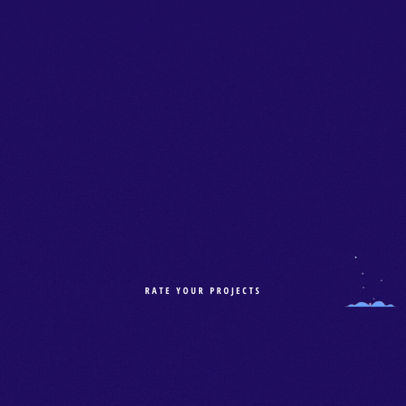

# zoo-awwards
A Django application like Awwards (It doesn't necessarily have to be exactly the same). The application will allow a user to post a project he/she has created and get it reviewed by his/her peers.

[](https://www.python.org/)



The application will allow a user to post a project he/she has created and get it reviewed by his/her peers.

A project can be rated based on 3 different criteria

* Design
* Usability
* Content
* These criteria can be reviewed on a scale of 1-10 and the average score is taken.

1. User stories
As a user, I would like to:

* View posted projects and their details
* Post a project to be rated/reviewed
* Rate/ review other users' projects
* Search for projects
* View projects overall score
* View my profile page

2. API Endpoints
You should create an API so that users can access data from your application. You can create two API endpoints:

* Profile - This endpoint should return all the user profiles with information such as the username, bio, projects of the user and profile picture
* Projects- This endpoint should return information pertaining to all the projects posted in your application.


## Live Site

[link to deployed site](https://zoo-awwards.herokuapp.com/)

## Setup Instructions / Installation

### Getting Started

### Prerequisites

- Python and pip (I am currently using 3.9.7) Any version above 3.7 should work.
* Git installed on your machine
* Code editor/ IDE
* PostgreSQL installed on your machine 

### Installation and Running the App

1. Clone GitHub repository

    ```shell
    git clone https://github.com/KenMwaura1/zoo-awwards
    ```

2. Change into the folder

    ```shell
   cd zoo-awwards
    ```

3. Create a virtual environment

   ```shell
      python3 -m venv venv 
   ```

    * Activate the virtual environment

   ```shell
   source ./bin/activate
   ```

* If you are using [pyenv](https://github.com/pyenv/pyenv):

  3a. Create a virtualenv

   ```
       pyenv virtualenv zoo_awwards
   ```

  3b. Activate the virtualenv

   ```
   pyenv activate zoo_awwards
   ```

4. Create a `.env` file and add your credentials

   ```
   touch .env 
   ```

   OR Copy the included example

    ```
    cp .env-example .env 
    ```

5. Add your credentials to the `.env` file

   5a. Create a [free cloudinary account](https://cloudinary.com/) and get your credentials to enable photo uploading deployed.

   OR

   5b. Uncomment **line 17**  and **line 43** in **z_awwards/models.py** to save and serve images locally.


6. Migrate your database
    ```shell
    python manage.py migrate
    ```

7. Install the required dependencies

   ```shell
   pip install -r requirements.txt
   ```

8. Make the shell script executable

    ```shell
   chmod a+x ./run.sh
    ```

9. Run the app

    ```shell
   ./run.sh
    ```

   OR
   run with python

    ```shell
   python manage.py runserver
    ```

## Tests

* To run the tests:

    ```shell
  python manage.py test
    ```

## Technologies used

* Python-3.9.7
* Django web framework
* PostgreSQL
* Cloudinary
* Bootstrap(Material Bootstrap 4)
* HTML5
* CSS3

## Author

[Ken Mwaura](https://github.com/KenMwaura1)


## LICENSE

MIT License

Copyright (c) 2021 Kennedy Ngugi Mwaura

Permission is hereby granted, free of charge, to any person obtaining a copy
of this software and associated documentation files (the "Software"), to deal
in the Software without restriction, including without limitation the rights
to use, copy, modify, merge, publish, distribute, sublicense, and/or sell
copies of the Software, and to permit persons to whom the Software is
furnished to do so.
